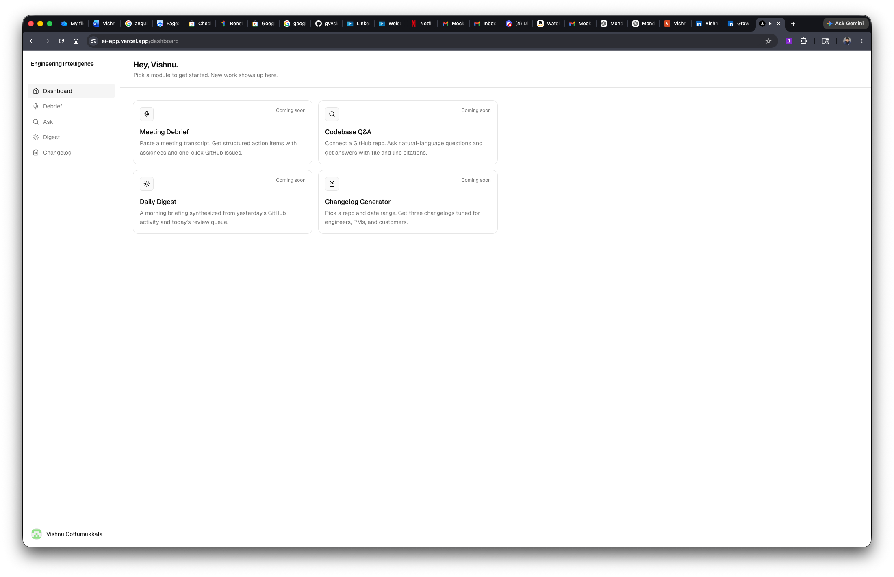
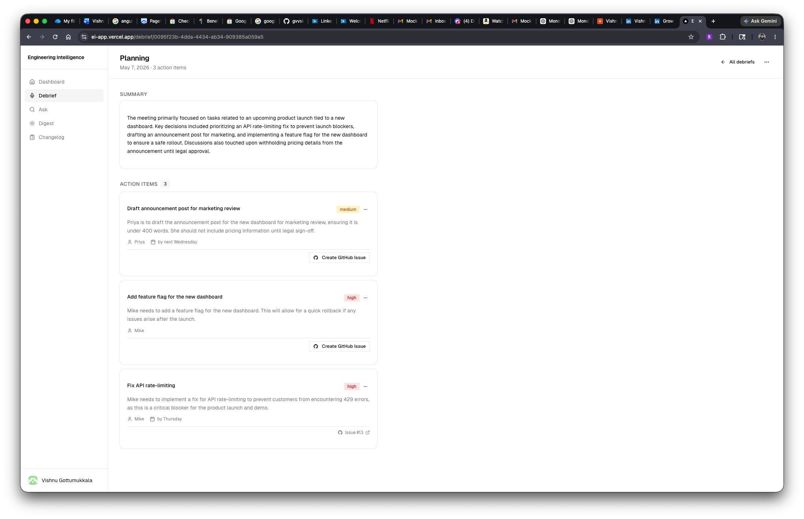
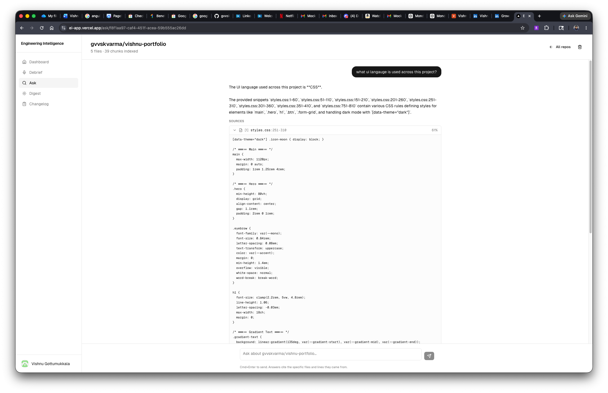
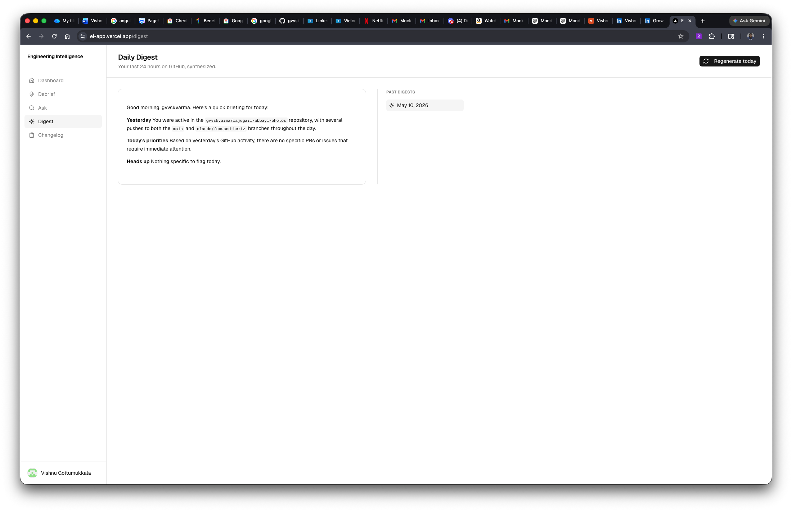
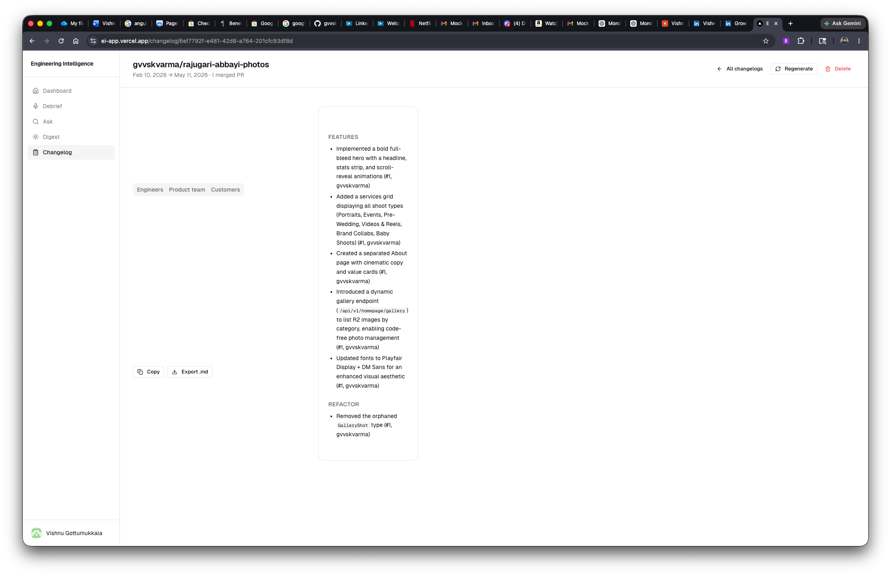
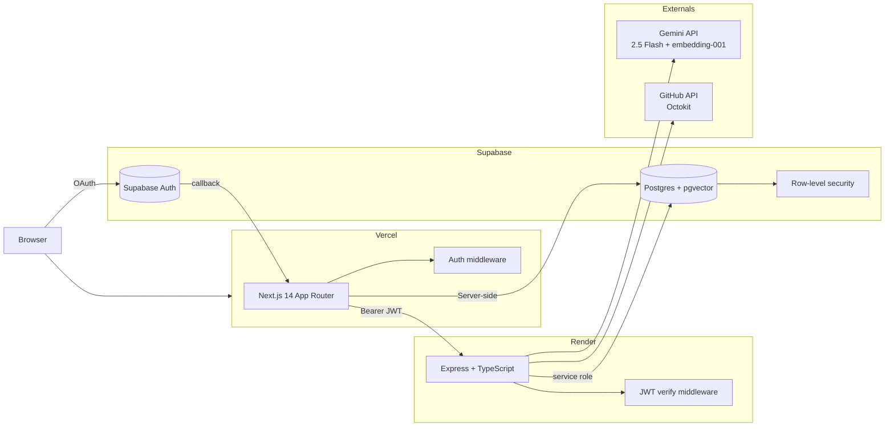

# Engineering Intelligence Platform

> An AI platform for engineering teams: meeting debriefs → action items, codebase Q&A with citations, daily activity digests, and audience-tuned changelogs. **Four modules, one codebase, $0 hosting.**

**🔗 Live:** [ei-app.vercel.app](https://ei-app.vercel.app) &nbsp;·&nbsp; **📦 Repo:** [github.com/gvvskvarma/engineering-intelligence](https://github.com/gvvskvarma/engineering-intelligence)



---

## What it is

A working AI product, not a demo. Engineers spend their day in a few familiar loops — running meetings, navigating unfamiliar code, opening PRs, writing release notes. Each one wastes signal in ways an LLM can fix. This is four of those loops, each shipped end-to-end:

- **Meeting Debrief** turns a raw transcript into structured action items and one-click GitHub issues
- **Codebase Q&A** indexes any repo into pgvector and answers questions with file/line citations grounded in real code
- **Daily Digest** synthesizes 24h of your GitHub activity into a morning briefing
- **Changelog Generator** writes three audience-tuned release notes from merged PRs

All running on free tiers — Vercel + Render + Supabase + Gemini. No paid services, no abandoned features.

### Who this is for

**Built for solo devs, OSS maintainers, and individual engineers exploring AI workflows on code they own or have read access to.** Everything works on public data — none of the modules require connecting proprietary or company repos. Sign in with personal GitHub, point it at a public repo, see it work.

Teams handling sensitive code should self-host (Docker compose target lives at the bottom of this README). SOC 2, SSO, BYO-LLM, and the enterprise security review process are explicitly *not* scoped here.

---

## Try it in 60 seconds

[Live URL](https://ei-app.vercel.app) → sign in with personal GitHub → pick any module → use one of these as your test target:

| Module | Try this |
|---|---|
| 🎙️ **Meeting Debrief** | Paste any meeting-style text. Even a fictional script works — the AI extraction quality is what's on display, not the meeting content. |
| 🔍 **Codebase Q&A** | Connect this very repo (`gvvskvarma/engineering-intelligence`) and ask *"How does the codebase Q&A indexer work?"* Or try a public OSS repo like `vercel/next.js` (large) or `expressjs/express` (compact). |
| ☀️ **Daily Digest** | Just generate. Pulls your public GitHub activity. Works even on days you didn't push anything. |
| 📋 **Changelog Generator** | Pick any public repo with recent merged PRs and a 7-day window. Try `vercel/next.js`, `withastro/astro`, or `expressjs/express`. |

Everything below is *how* it's built.

---

## The four modules

### 🎙️ Meeting Debrief



Paste a meeting transcript. Gemini extracts a summary + structured action items (title, assignee, priority, due date) using JSON-mode with a strict response schema. Each action item has a one-click "Create GitHub Issue" button that opens a repo picker and writes the issue via Octokit, labelled with `priority/<level>` and `meeting-action-item`. The issue URL persists back to the database so the card flips from a button to a permalink.

**Worth a look:** [`apps/api/src/services/debrief.ts`](apps/api/src/services/debrief.ts) — the extraction service and response schema. [`apps/api/src/routes/github.ts`](apps/api/src/routes/github.ts) — how the GitHub provider token captured during OAuth gets reused for issue creation.

### 🔍 Codebase Q&A (RAG)



Connect a GitHub repo. The backend fetches the file tree via Octokit, filters to source files, chunks them (line-based with overlap; AST-aware in iteration 2), embeds each chunk via Gemini `gemini-embedding-001` at 768 dimensions, and stores them in Supabase `pgvector` with an HNSW index. Asking a question embeds the query, runs a cosine-similarity RPC against the chunks, and feeds the top-K back to Gemini with a tightly-tuned grounding prompt. Each answer shows clickable citations with file path, line range, and similarity score.

**Worth a look:** [`apps/api/src/services/codebase-indexer.ts`](apps/api/src/services/codebase-indexer.ts) — batch embedding logic, retry-on-429, failure-reason persistence. [`apps/api/src/services/codebase-query.ts`](apps/api/src/services/codebase-query.ts) — the prompt that tells Gemini to distinguish *usage* from *mention* (a real RAG groundedness bug from this build, see below).

### ☀️ Daily Digest



Pulls 24h of activity from the GitHub API — PRs you authored, PRs awaiting your review, issues you commented on, recent pushes — and asks Gemini to synthesize a morning briefing structured as *Yesterday → Today's priorities → Heads up*. The prompt enforces a "smart colleague" tone, not bullet-dump. A collapsible "Raw activity" block underneath shows exactly which PRs and pushes were fed in, so you can spot if the model invented anything.

A "quiet day" shortcut bypasses the LLM entirely if there's no activity, saving daily quota and producing a more useful "use the time on something deeper" message.

**Worth a look:** [`apps/api/src/services/digest.ts`](apps/api/src/services/digest.ts) — parallel Octokit search across multiple activity types.

### 📋 Changelog Generator



Pick a repo and a date range. The backend fetches all merged PRs in the window (paginated, capped at 200), truncates fat PR bodies for prompt sanity, and calls Gemini once with a structured-output schema returning three Markdown strings: **engineer**, **PM**, **customer**. Each audience gets different grouping rules — engineers see PR numbers and breaking-change callouts; PMs see feature framing without code jargon; customers get plain English *"You can now…"* benefits with internal/refactor work filtered out entirely.

Copy-to-clipboard and `.md` export per tab. Regenerate with a new window any time.

**Worth a look:** [`apps/api/src/services/changelog.ts`](apps/api/src/services/changelog.ts) — the three-audience prompt and Gemini structured-output schema.

---

## Architecture



**Key boundaries:**

- The web app holds **two Supabase clients**: a browser singleton for client-side reads (subject to RLS) and a **server-only admin client** gated by `import "server-only"` for routes that need to bypass RLS during the OAuth callback (writing the GitHub provider token to `github_connections`).
- The Express API receives the user's JWT in the `Authorization` header, verifies it via `supabase.auth.getUser()` middleware, and uses the **service role client** for all DB queries — manually scoping by `user_id` for defense in depth alongside RLS.
- The `Gemini API` calls happen exclusively from the backend so the API key never touches the browser.
- `Octokit` instances are constructed per-request from the stored provider token, then thrown away.

---

## Tech stack

| Layer | Choice | Why |
|---|---|---|
| Frontend | **Next.js 14** (App Router) | SSR + server-side cookie handling for Supabase auth; route groups for `(auth)` / `(dashboard)` layout segmentation |
| UI | **TailwindCSS + shadcn/ui** (canary, base-ui under the hood) | Accessible primitives without writing a design system from scratch |
| State | **TanStack Query** | Caching, polling for indexing status, mutation invalidation that fans out across views |
| Backend | **Express 5 + TypeScript strict** | Boring, fast, easy to deploy. Strict TS catches the integration bugs early |
| LLM | **Google Gemini 2.5 Flash** | Free tier covers a portfolio's traffic; JSON-mode with response schemas is excellent for structured extraction |
| Embeddings | **Gemini `gemini-embedding-001`** at 768 dims | `outputDimensionality` parameter keeps the embeddings aligned with a `vector(768)` pgvector column without rebuilding the schema |
| Vector DB | **Supabase pgvector + HNSW** | One database for auth, RLS, regular tables, and embeddings — no separate vector store to operate |
| Auth | **Supabase Auth (GitHub OAuth)** | The OAuth flow naturally gives us a GitHub `provider_token` we reuse for issue creation and repo reads — no separate connect step |
| Hosting | **Vercel + Render** | Both free tiers, both auto-deploy on `git push` |

**One Supabase Postgres handles:** sessions, JWT issuance, RLS-enforced multi-tenant data, vector similarity search, and webhooks (deferred). This was a deliberate choice — every "what if I need X" answer was already "Supabase does X."

---

## Engineering decisions worth a look

A few decisions in this build that were either non-obvious going in, or only obvious after a failure:

### Batch embeddings to stay inside free-tier limits

The naïve "one chunk at a time" embedding loop hit Gemini's free-tier daily request cap on a 50-file repo. Switching to `batchEmbedContents` (up to 100 texts per request) dropped the call count from `N` to `ceil(N / 100)` — a 50-file repo went from ~150 requests to 2.

`outputDimensionality: 768` isn't exposed in the older SDK, so the backend calls the REST endpoint directly to keep embeddings aligned with the pgvector schema. See [`apps/api/src/services/gemini.ts`](apps/api/src/services/gemini.ts).

### Vector search via Postgres RPC, not raw SQL

`supabase-js` can't easily pass a `vector(768)` literal into a regular query. The solution is a Postgres function:

```sql
create function match_code_chunks(
  query_embedding vector(768),
  filter_repo_id uuid,
  filter_user_id uuid,
  match_count int default 8
) returns table (...)
language sql stable as $$
  select cc.*, 1 - (cc.embedding <=> query_embedding) as similarity
  from code_chunks cc
  where cc.repo_id = filter_repo_id and cc.user_id = filter_user_id
  order by cc.embedding <=> query_embedding
  limit match_count;
$$;
```

Then `supabase.rpc("match_code_chunks", { query_embedding: [...], ... })` from the backend. RLS still applies. See [`supabase/migrations/006_match_code_chunks.sql`](supabase/migrations/006_match_code_chunks.sql).

### RAG groundedness — distinguishing *usage* from *mention*

The first interesting failure: asked "is React used in this codebase?" on an HTML portfolio repo, the model answered *yes*. The portfolio's body copy mentioned past React projects, so cosine similarity surfaced those chunks; the model treated mention as evidence of usage.

Patched in iteration 1 with a system-prompt that explicitly forbids inferring usage from prose, and orders the model to check file extensions and manifests. The proper fix (deferred to iteration 2) is to compute a **repo profile** at index time — parsed `package.json` / `requirements.txt` / `go.mod`, file-extension breakdown — and inject it as guaranteed context alongside the retrieved chunks. Notes are in [`MEMORY.md`-equivalent project notes].

### Background indexing is fragile on free hosting

Render free-tier services can restart at any time. The indexer runs as a fire-and-forget Promise after the request returns 202, but if the service restarts mid-run the row gets stuck in `status='indexing'` forever. Two mitigations shipped:

1. **`failure_reason` column on `code_repos`** — `humanReason(err)` translates raw errors into something useful ("Hit Gemini's free-tier rate limit", "Couldn't access the repo"), persisted on failure and rendered in the detail UI
2. **Retry-on-429 with 30s backoff** — for transient rate limits during the embedding batch

Deferred for iteration 2: a stuck-row detector (timeout > 10 min → mark as failed) and ultimately a proper queue.

### Base UI vs Radix — same shape, different prop semantics

This project's `shadcn/ui` canary uses `@base-ui/react` rather than Radix. Two real bugs from that:

1. **`asChild` doesn't exist on Base UI primitives.** You either use the `render` prop or apply `buttonVariants()` directly via `className`. Nesting two Base UI components via `render={<Button />}` actually swallows the click handler — the menu trigger never opens.
2. **`MenuItem` uses `onClick`, not `onSelect`.** The sign-out button shipped with `onSelect` and silently did nothing — no network call, no error.

Both shipped as quiet bugs and were fixed once observed. The lesson is to verify the primitive's prop semantics against the actual library, not the framework it resembles. Notes saved to project memory for future component work.

---

## Local development

Prerequisites: Node 20+, a Supabase project, a Gemini API key, and a GitHub OAuth app.

```bash
# 1. Clone and copy env templates
git clone https://github.com/gvvskvarma/engineering-intelligence.git
cd engineering-intelligence
cp .env.example apps/web/.env.local
cp .env.example apps/api/.env

# 2. Fill in the keys in both .env files (see .env.example for the list)

# 3. Run Supabase migrations
#    Paste each file in supabase/migrations/ into the Supabase SQL editor in order,
#    or use the Supabase CLI: supabase db push

# 4. Start both apps in two terminals
cd apps/api && npm install && npm run dev   # → http://localhost:4000
cd apps/web && npm install && npm run dev   # → http://localhost:3000

# 5. Open http://localhost:3000 and sign in
```

For GitHub OAuth setup, the callback URL is `https://<your-supabase-url>/auth/v1/callback` — that's Supabase's callback, not your app's.

---

## What's deferred

Honest about what's not done:

- **Phase 3 Iter 2 — RAG groundedness via repo profile** Compute a deterministic tech-stack profile (manifests + extension breakdown) at index time and inject as guaranteed context. Also: hybrid retrieval (keyword boost for tech-stack questions) and a file-type-aware reranker on top of vector hits.
- **Tier 3 — GitHub webhook sync for action items** When a linked GitHub issue closes, auto-mark the source action item as `done`. Needs a public ingest endpoint with HMAC signature verification and a per-repo webhook registration flow.
- **Phase 2 Tier 2 — action item status tracking** Currently action items don't track a local status (`open/in_progress/done`). Defensible omission since the GitHub issue's state is the source of truth once one is created, but a few use cases (no-issue items, batch triage) would benefit.
- **Phase 3 streaming responses** Currently RAG answers return full payloads. Token-by-token SSE streaming would be a 30-minute add and is the cherry on top for a demo.

---

## License

MIT. See `LICENSE` for details. Built as a portfolio project — happy to talk about any of the design decisions above.

---

## Contact

Vishnu Gottumukkala &nbsp;·&nbsp; [github.com/gvvskvarma](https://github.com/gvvskvarma)
